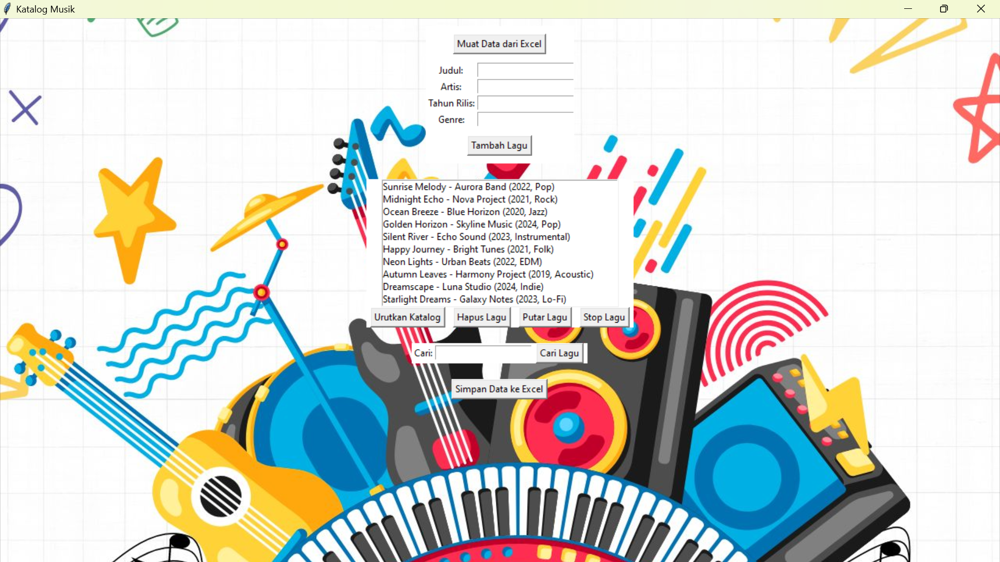
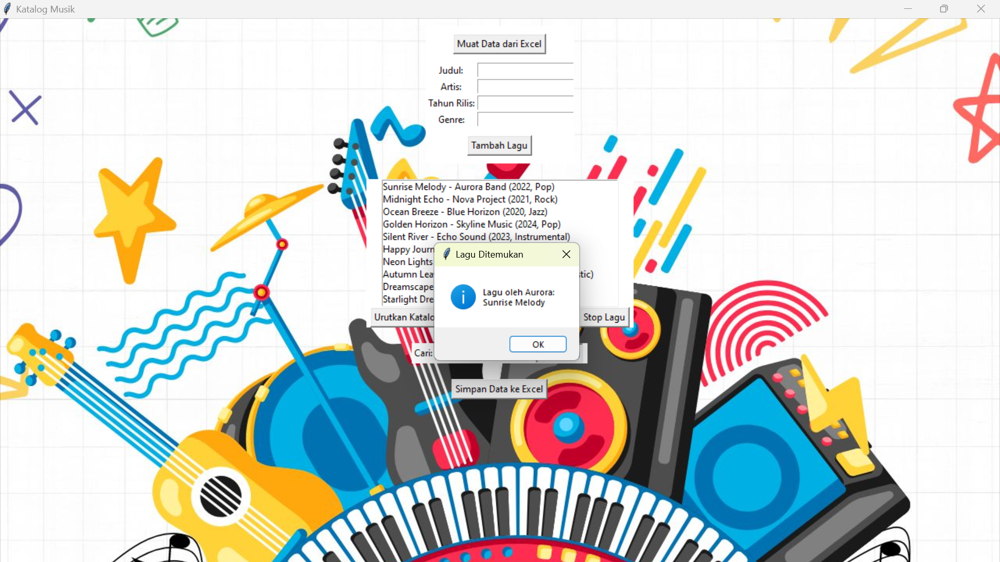

# 🎵 Music Catalog GUI

Music Catalog GUI is a desktop application developed using Python and Tkinter to manage a music catalog. Users can import data from Excel, add new songs, search, sort, delete, export data, and play audio files stored on their computer.

## ✨ Features

- Import music catalog from Excel
- Add new songs
- Search songs by title, artist, year, or genre
- Sort music catalog
- Delete songs
- Export catalog to Excel
- Play and stop audio files
- User-friendly GUI

## 🛠 Technologies

- Python
- Tkinter
- Pandas
- Pygame
- Pillow (PIL)
- OpenPyXL

## 📁 Files

- `main.py` → Main application source code
- `music_catalog.xlsx` → Sample dataset
- `background.jpg` → Application background image
- `requirements.txt` → Required Python libraries

## 📸 Application Preview

### Main Interface



### Search Feature



## ▶️ How to Run

1. Install the required libraries:

```bash
pip install -r requirements.txt
```

2. Run the application:

```bash
python main.py
```

3. Click **"Muat Data dari Excel"** and select `music_catalog.xlsx`.

> **Note:** Audio files (.mp3) are not included in this repository due to copyright considerations. The application can still be tested using the provided sample dataset.

## 👨‍💻 Author

**Fadilla Afsari**
